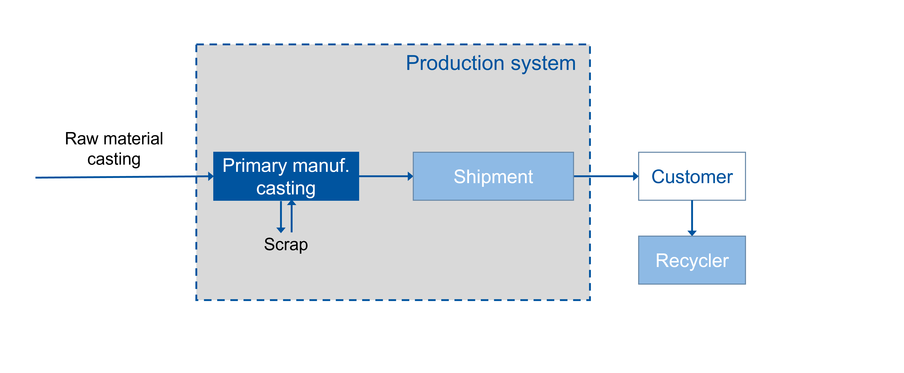
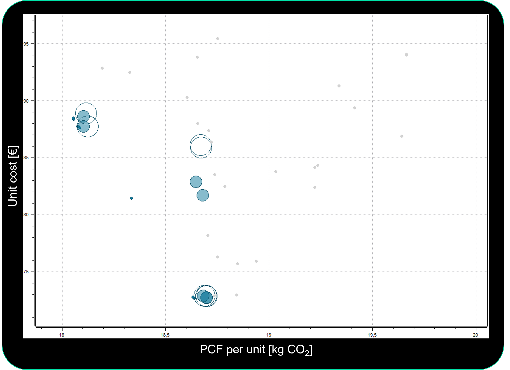
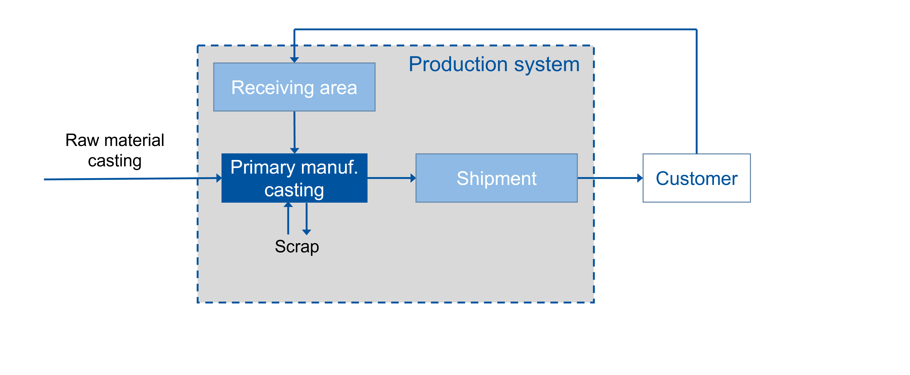
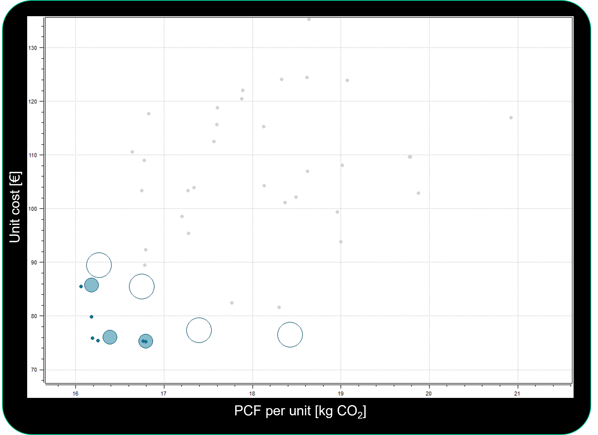
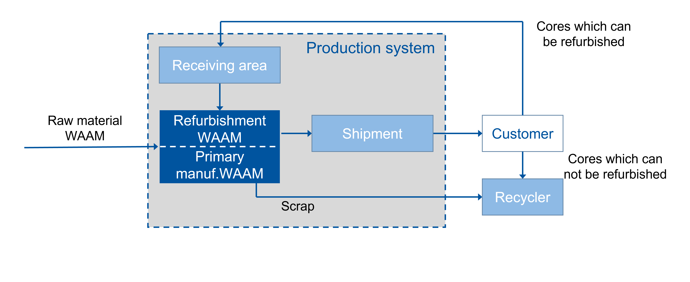
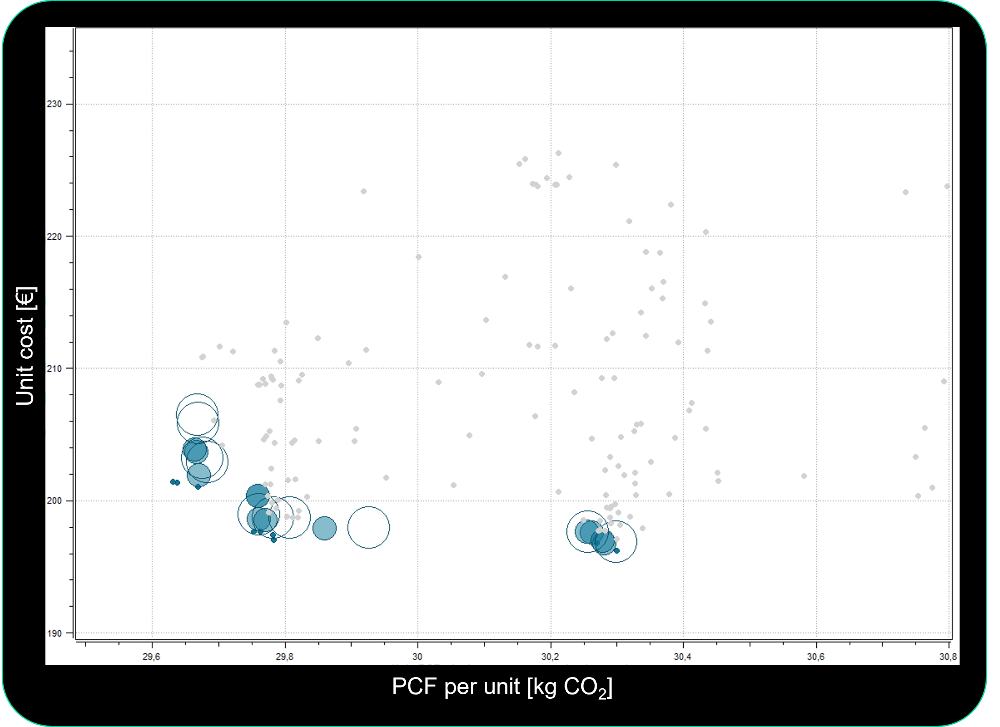
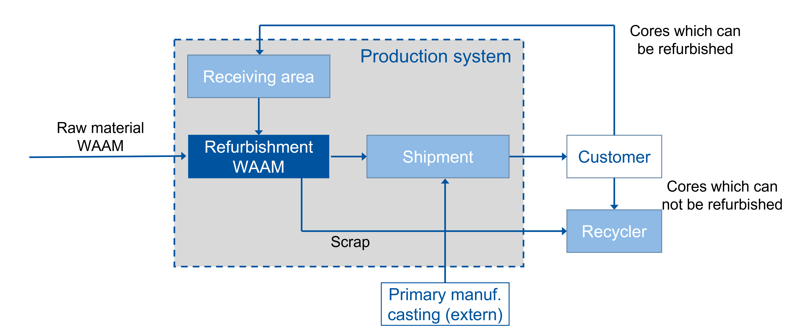
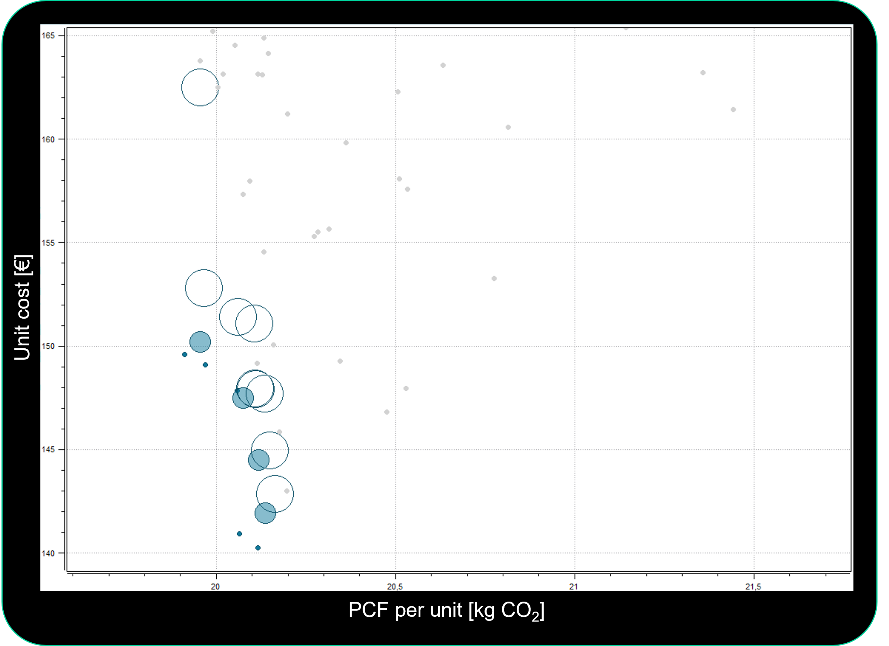
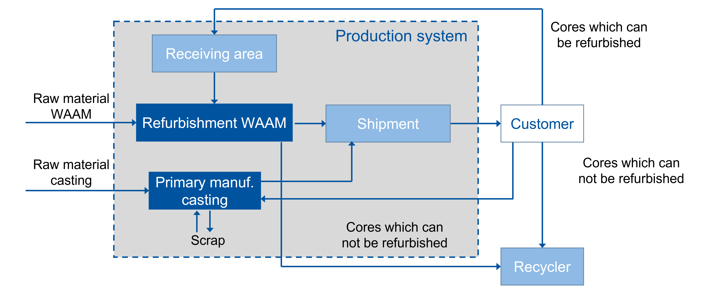
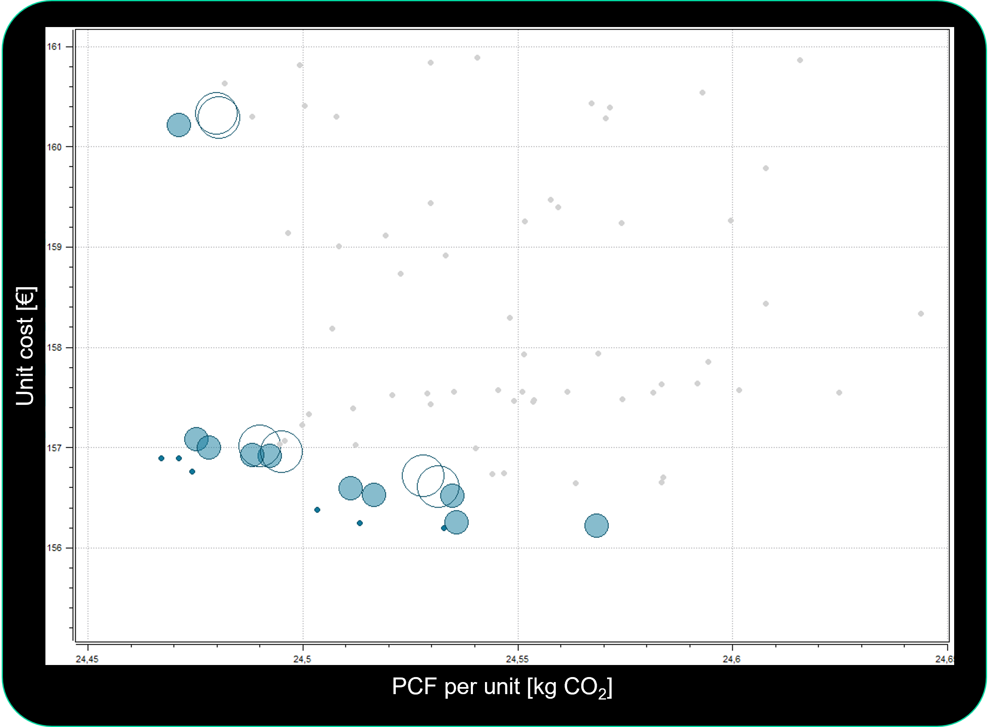

# Application of Discrete Event Simulation and Multi-objective Optimization for Tactical Planning in Circular Production Systems

[](https://creativecommons.org/licenses/by/4.0/)

## About

This repository contains supplementary data and results for the paper:

> **"Application of Discrete Event Simulation and Multi-objective Optimization for Tactical Planning in Circular Production Systems"**  
> Alexander Dranov, Moritz Mersch, Henrik Gerdes, Max Juraschek, Christoph Herrmann  
> *Procedia CIRP* (CIRP Conference on Manufacturing Systems (CIRP CMS), 2026)

---

## Abstract

Circular Economy strategies such as reuse, repair, remanufacturing, and refurbishment offer significant potential for reducing raw material demand and greenhouse gas emissions. However, their widespread implementation faces major barriers, particularly uncertainties in reverse supply chains regarding unpredictable quantity and variable quality of returned components. These uncertainties complicate tactical planning decisions such as technology selection and capacity planning for end-of-life processing and require improved data availability. Structured data models, such as the Asset Administration Shell, provide a foundation for structured data models of products and manufacturing equipment. Building on these standards, custom models capture machine load profiles, technology chains, and product-equipment interactions to enable techno-economic and environmental assessment of circular production system configurations. This work presents an integrated framework combining Discrete Event Simulation with multi-objective optimization to identify Pareto-optimal system configurations based on unit cost and unit product carbon footprint. The framework is applied to a case study on ductile cast iron contact shoes for third-rail current collectors, comparing linear manufacturing, recycling, refurbishment, and hybrid manufacturing-refurbishment strategies over a multi-year planning horizon. Results demonstrate that refurbishment viability critically depends on wear volume, deposition material properties, and process compatibility.

---

## System Configurations

Five circular production strategies were evaluated and optimized for **unit cost** and **unit product carbon footprint (PCF)**. The following sections show the system designs and corresponding Pareto fronts (first-order non-dominated solutions).

---

### Strategy 1: Primary Manufacturing (Gravity Casting)

Linear production system with gravity casting as the primary manufacturing process.



**Pareto Front:**



---

### Strategy 2: Primary Manufacturing (Gravity Casting) and Recycling

Closed-loop system integrating gravity casting with end-of-life recycling to reduce material waste and emissions.



**Pareto Front:**



---

### Strategy 3: Primary Manufacturing and Refurbishment (WAAM)

Integrated system using Wire Arc Additive Manufacturing (WAAM) for both primary production and refurbishment of returned cores.



**Pareto Front:**



---

### Strategy 4: Refurbishment (WAAM) + Purchase of Casting Parts

Hybrid sourcing strategy combining in-house WAAM refurbishment with external procurement of new casting parts.



**Pareto Front:**



---

### Strategy 5: Hybrid WAAM/Casting System

Flexible production system combining gravity casting and WAAM refurbishment in-house to balance cost and environmental impact.



**Pareto Front:**



---

## Data Files

### Model Input
**`Model_Input/ModelParameter.xlsx`** contains all relevant input parameters for modeling, simulation, and optimization:
- Process times, costs, energy consumption
- Material properties, scrap rates, return rates
- Demand scenarios, workforce parameters

### Output Files
- **`Output/KPI_Files/`**: Detailed KPI data for all evaluated system configurations (unit cost, unit PCF, cycle times, lead times, resource utilization, throughput rates)
- **`Output/Distance_To_Target/`**: Gap analysis for WAAM material properties (target values for cost parity with casting, sensitivity analysis results)
- **`Output/Pareto_Fronts/`**: Pareto front visualizations for all strategies

---

## Citation

If you use this data in your research, please cite:

```bibtex
@article{DRANOV2026487,
  title = {Application of Discrete Event Simulation and Multi-objective Optimization for Tactical Planning in Circular Production Systems},
  journal = {Procedia CIRP},
  volume = {146},
  pages = {487-492},
  year = {2026},
  note = {CIRP Conference on Manufacturing Systems (CIRP CMS)},
  issn = {2212-8271},
  doi = {https://doi.org/10.1016/j.procir.2026.03.272},
  url = {https://www.sciencedirect.com/science/article/pii/S2212827126012357},
  author = {Alexander Dranov and Moritz Mersch and Henrik Gerdes and Max Juraschek and Christoph Herrmann}
}
```

---

## Contact

For questions regarding this data:

**Alexander Dranov**  
Siemens AG  
dranov.alexander@siemens.com

---

## License

This work is licensed under [Creative Commons Attribution 4.0 International (CC-BY-4.0)](LICENSE).

You are free to share and adapt the data, provided you give appropriate credit and indicate if changes were made.

---

## Acknowledgments

This research was funded by the Federal Ministry of Research, Technology and Space (BMFTR) within the "The Future of Value Creation – Research on Production, Services and Work" program (Grant 02J21E112) and managed by the Project Management Agency Karlsruhe (PTKA).
